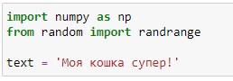
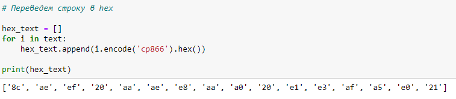
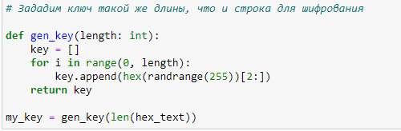
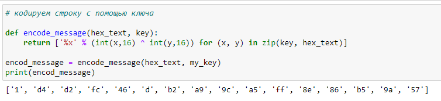
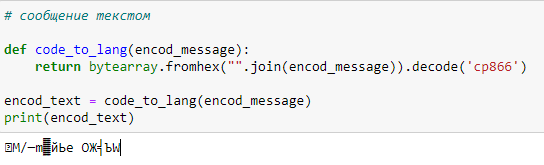
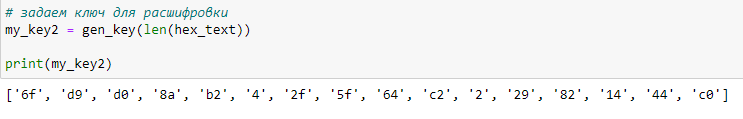
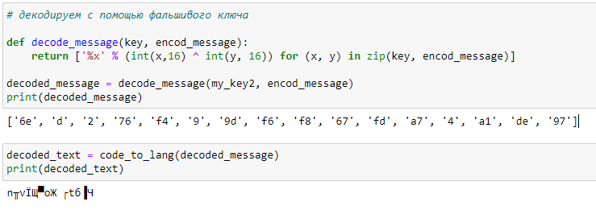
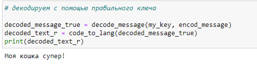

# Лабораторная работа 7.
## Элементы криптографии. Однократное гаммирование

## Выполнила студентка группы НФИбд-02-19: Комарова Ирина Сргеевна 1032192866

## Задание
    Освоить на практике применение режима однократного гаммирования

## Теоретическое введение
С точки зрения теории криптоанализа метод шифрования однократной случайной равновероятной гаммой той же длины, что и открытый текст, является невскрываемым (далее для краткости авторы будут употреблять термин "однократное гаммирование", держа в уме все вышесказанное). 

Обоснование, которое привел Шеннон, основываясь на введенном им же понятии информации, не дает возможности усомниться в этом - из-за равных априорных вероятностей криптоаналитик не может сказать о дешифровке, верна она или нет. Кроме того, даже раскрыв часть сообщения, дешифровщик не сможет хоть сколько нибудь поправить положение - информация о вскрытом участке гаммы не дает информации об остальных ее частях.

## Ход работы.
1.  Составила краткий план работа.

2. Импортировала модели и определила текст для шифрования и дешифрования. Выбрала свой вариант.

3. Перевела строку в шестнадцатеричный вид.

4. Задала ключ, учитывая длину строки.

5. Закодировала строку с помощью ключа.

6. Добавила функцию, которая выводит сообщение текстом. Посмотрела на зашифрованное сообщение.

7. Создала ключ для расшифровки.

8. Декодировала с помощью фальшивого ключа и посмотрела, что получилось.

9. Декожировала верным ключом. Получила исходное сообщение.

## Вывод 
    Я освоила на практике применение режима однократного гаммирования

## Библиография
1. Методические материалы курса. “Информационная безопасность компьютерных сетей” Кулябов Д. С.,Королькова А. В., Геворкян М. Н.